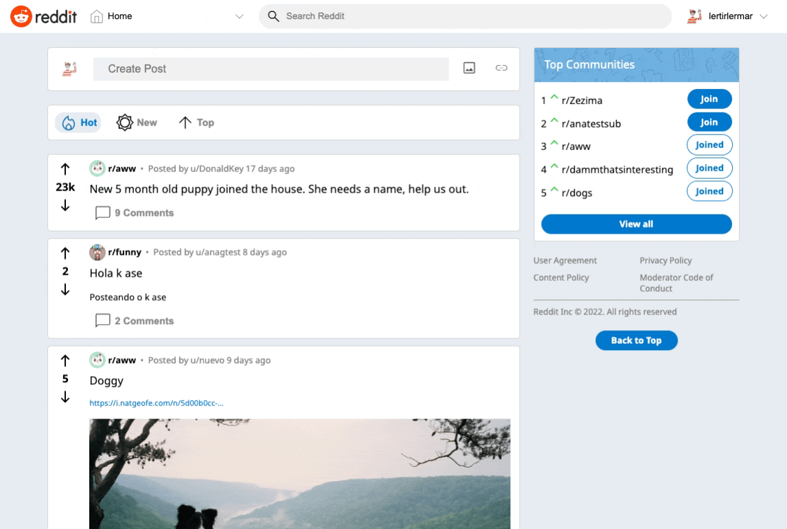

# Reddit clone

Front end of reddit clone [MERN](https://www.mongodb.com/mern-stack) app. Made with TypeScript using React and Redux.

Code for the Back end can be found [here](https://github.com/hectorgonzalezo/reddit-clone-server)

By [Héctor González Orozco](https://github.com/hectorgonzalezo)

## :computer: Built With

* [ReactJS](https://reactjs.org/)
* [Redux](https://redux.js.org/)

## :ferris_wheel: Live Preview

[https://reddit-clone-52.netlify.app/](https://reddit-clone-52.netlify.app/)

## :rocket: Features

Most of reddit's features are implemented, such as:

- User sign up and log in.

- View posts and subreddits.

- Users can comment, submit posts and create their own subreddits, as well as update their own icons.

- Posts can be displayed in order by hot, new and top.

## :construction: Installing

1. Clone the repository

`git clone https://github.com/hectorgonzalezo/reddit-clone`

2. Install dependencies

`npm install`

3. Create a .env file on root directory of project with firebase api key used to save images. The format must be the following:

`REACT_APP_FIREBASE_API_KEY="apiKey"`

4. Start the development server

`npm start`

Typescript code can be compiled by using the following command: 

`npm run build`

## :white_check_mark: Tests

All important components are thoroughly tested. To run tests use:

`npm test`

## :camera: Sneak Peek

